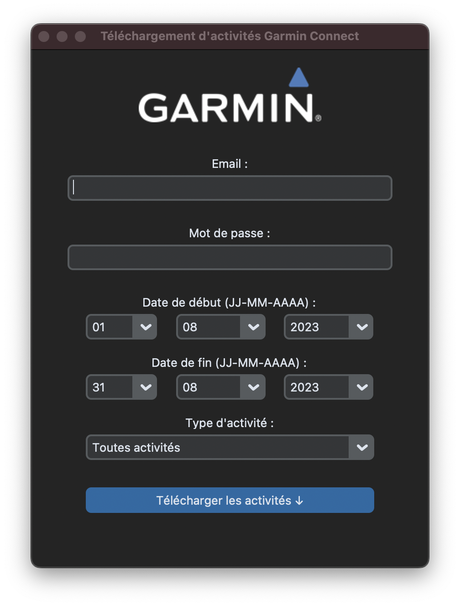

# garmin-fetch

Garmin-Fetch is a GUI application built on top of the [garminconnect python package](https://github.com/cyberjunky/python-garminconnect) to streamline the process of fetching activity data from Garmin Connect. Using a simple interface made using [Custom Tkinter](https://customtkinter.tomschimansky.com/), users can input their Garmin Connect credentials, specify a date range, and download their activity data with ease.

> **Disclaimer**
> For the moment, this application is only available in French.

<p align="center">
  
</p>

## Setup and run

1. **Clone the repository**

```bash
$ git clone https://github.com/nicohlr/garmin-fetch.git
$ cd garmin-fetch
```

2. **Set up a virtual environment (recommended)**
   
This ensures that the project's dependencies are isolated from your system.

```bash
$ conda create -n myenv python=3.10
```

Activate the virtual environment:

```bash
$ conda activate myenv
```

3. **Install the required packages**:

```bash
$ pip install -r requirements.txt
```

4. **Run the project:**

```bash
$ python src/app.py
```

## Packaging with PyInstaller

If you wish to create a standalone executable of the application, you can use PyInstaller. This will generate an executable specific to your operating system, making it easy to distribute and run the application without needing a separate Python environment.

1. **Install PyInstaller**:

```bash
$ pip install pyinstaller
```

2. **Package the application**:

```bash
pyinstaller --onefile --icon imgs/garmin-download.ico --name GarminFetch --windowed --add-data='assets/;assets/' --add-data <PATH_TO_CUSTOMTKINTER> src/garmin.py
```

This will create a standalone executable in the `dist` directory. 

> **Note**
> You have to manually include the customtkinter directory with the --add-data option of pyinstaller.
> The path of the customtkinter directory can be found using the command: `pip show customtkinter``


